# 如何扩展

JLisp 是一个可扩展的架构。用户可以基于它，自定义自己的语言解释器。

参考阅读：[基于 JLisp 自定义一个规则引擎](https://dwb2x3ph3w7.feishu.cn/docx/BsAtdA7pXouC8Nx3bucc7iWhnde)

# 基于 JLisp 自定义一个规则引擎

[JLisp](https://github.com/aclisp/jlisp) 是一个编程语言解释器，代码完全开源。本文告诉你如何基于 JLisp 创建一个规则引擎。

# 项目设置

引用 JLisp 可以添加 maven 依赖

```xml
<dependency>
  <groupId>io.github.aclisp</groupId>
  <artifactId>jlisp-core</artifactId>
  <version>1.0.14</version>
</dependency>
```

当前处于 Alpha 阶段，版本会不断更新。

# 先看一个最基本的例子

我们的规则引擎打算实现以下这个形式



根据上面的流程图分析一下，这个形式具有这些特点

- **方框框**：表示某种操作。例如“查询数据”或者“操作数据”
- **菱形**：表示决策判断。根据前一个操作的结果，决定怎么办
- **子流程**和“内联子流程”：决策之后，继续执行某种操作，然后再决策，再操作……如此往复，直到结束。

    - 如果我们把决策之后的动作，看作一个整体，那这个整体可以叫做“子流程”。
    - 当然，直接画在当前这个流程图里的“整体”，是“内联子流程”；
    - 画在别的地方，就是引用别的“子流程”

值得注意的一点是，如果把“开始”之后的内容，也看成一个**子流程**，那么我们这个规则引擎的表述就是“操作，决策，子流程”不断嵌套。

# 用 JLisp 代码来描述

根据这个表述，下面用 JLisp 提供的 API 构造出对应的代码。

## 最基本思想

在 JLisp 中，对应子流程的数据结构叫做 `ListExpression`。顾名思义，它是一个 `ArrayList<Expression>` 的子类，表达的意思是，一系列“形式”的有序集合。

注意看，前面说了所谓“形式”，具体细分为**方框框**、**菱形**和**子流程**。它们都是“形式”。在 JLisp 里，“形式”对应的数据结构叫做 `Expression` 。它是一个 Java interface。

既然**子流程**也是一种特化的“形式”，那 `ListExpression` 显然也是一种 `Expression`。

说了那么多，是不是快被绕晕了？其实用 Java 语言来定义**子流程**，就一目了然！

```java
public class ListExpression extends ArrayList<Expression> implements Expression {
    // 内容略...
}
```

以上，就是 JLisp 的最基本思想。我们再正式的总结一遍

- JLisp 的执行对象为 `ListExpression`
- `ListExpression` 是一个有序列表，由一系列按照顺序的 `Expression` 组成
- `ListExpression` 自身也是一种 `Expression`，因此可以不断嵌套，组成足够复杂的规则，不断执行下去

## 试试如何组装

现在试试用 JLisp 提供的 API 来组装这个流程


涉及到三个**方框框**的操作，先把操作定义出来

```java
class XQuery extends Function {

    @Override
    public Expression invoke(ListExpression args) throws Exception {
        System.out.println("XQuery: " + args);
        return Expression.of(2);
    }
}

class XSave extends Function {

    @Override
    public Expression invoke(ListExpression args) throws Exception {
        System.out.println("XSave: " + args);
        return Expression.of(null);
    }
}

class XSendMsg extends Function {

    @Override
    public Expression invoke(ListExpression args) throws Exception {
        System.out.println("XSendMsg: " + args);
        return Expression.of(null);
    }
}
```

具体的操作，需要用到数据库连接或者网络请求。我们这里的实现，暂时用 `System.out.println` 来模拟。

注意在 XQuery 里，我们返回数值 2 ，让流程接下来执行“发送通知”。后面会验证这一点。

流程图里有以下这些基本构件

- 操作 Operation
- 决策 Decision
- 分支 Branch
- 条件 Clause
- 变量 Variable

操作就是**方框框**啦，决策是**菱形**节点，分支是挂在决策之下的进一步操作，变量是隐含的，看起来是分支连接线上与 result 有关的条件，这里 result 就是一个变量。

用 JLisp 提供的 API 来分别定义操作、决策、分支、条件和变量

```java
private Expression buildOperation(String operationName, String parameter) {
    ListExpression p = new ListExpression();
    p.add(Symbol.of(operationName));
    p.add(Expression.of(parameter));
    return p;
}

private Expression defineVariable(String name, Expression value) {
    ListExpression p = new ListExpression();
    p.add(Symbol.of("def"));
    p.add(Symbol.of(name));
    p.add(value);
    return p;
}

private Expression buildDecision(Expression... branches) {
    ListExpression p = new ListExpression();
    p.add(Symbol.of("cond"));
    for (Expression branch : branches) {
        p.add(branch);
    }
    return p;
}

private Expression buildBranch(Expression clause, Expression operation) {
    ListExpression p = new ListExpression();
    p.add(clause);
    p.add(operation);
    return p;
}

private Expression buildClause(String operator, String variable, Object value) {
    ListExpression p = new ListExpression();
    p.add(Symbol.of(operator));
    p.add(Symbol.of(variable));
    p.add(Expression.of(value));
    return p;
}
```

基本构件和外部操作都定义好了，下面就可以把他们组装到一起，成为一个可以执行的工作流

首先需要设定好执行环境。

执行环境可以理解为工作流执行的上下文，在上下文里有你定义的变量，你定义的外部操作（即“指令”，下方有说明，请耐心往下看），以及 JLisp 内部需要用的资源。

每个工作流都需要有一个自己的执行环境

```java
Environment env = Default.environment();
env.put(Symbol.of("X_QUERY"), new XQuery());
env.put(Symbol.of("X_SAVE"), new XSave());
env.put(Symbol.of("X_SEND_MSG"), new XSendMsg());
```

然后是组装出主流程

```java
ListExpression process = new ListExpression();
process.add(Symbol.of("progn")); // 相当于“启动节点”
process.add(
        defineVariable("result",
                buildOperation("X_QUERY", "Account__s"))
);
process.add(
        buildDecision(
                buildBranch(buildClause("==", "result", 1),
                        buildOperation("X_SAVE", "")),
                buildBranch(buildClause("==", "result", 2),
                        buildOperation("X_SEND_MSG", ""))
        )
);
```

> JLisp 为了统一“形式”方便处理，要求每个 `ListExpression` 以“符号” (`Symbol`) 开头。可以把“符号”简单理解为编程语言里的“指令”。例如
> - “决策判断”指令为 `Symbol.of("cond")`
> - “启动流程”指令为 `Symbol.of("progn")`
>
> 你应该也注意到了，我们自行定义了额外的“指令”，例如 `X_QUERY` `X_SAVE` 和 `X_SEND_MSG`


在上面的例子中，组装分支条件 Clause 的方式为

```java
buildClause("==", "result", 2)
```

意思是检查变量 result 与数值 2 是否相等。`==` 是 JLisp 原生的操作符，它的定义为

```java
class Equal extends Function {

    public Expression invoke(ListExpression args) {
        for (int i = 0; i < args.size()-1; i++) {
            Object arg1 = args.get(i).getValue();
            Object arg2 = args.get(i+1).getValue();
            if (!Objects.equals(arg1, arg2)) {
                return Expression.of(false);
            }
        }
        return Expression.of(true);
    }

}
```

经过仔细观察，JLisp 的原生操作符的定义方式，与前面我们写的 `XQuery` `XSave` `XSendMsg` 定义的方式一模一样！因此，如果需要更加复杂的条件检测，（而不是仅仅比较两个变量是否相等），我们也可以自定义。例如

```java
class XMatch extends Function {
    
    @Override
    public Expression invoke(ListExpression args) throws Exception {
        // 具体的匹配规则实现略
        if (match) {
            return Expression.of(true);
        } else {
            return Expression.of(false);
        }
    }
}
```

别忘了，自定义的匹配规则，同自定义的外部操作一样，也需要注册到“执行环境”里，让 JLisp 认识它

```java
// Environment env = Default.environment();
// ...
env.put(Symbol.of("X_MATCH"), new XMatch());
```

到这里，再回顾一下你会发现，有关流程图的所有关键元素

- 操作 Operation
- 条件 Clause
- 变量 Variable

在 JLisp 里面都可以扩展和自定义！JLisp 很贴心的帮助你，按你的要求把这些元素组装好。这就是所谓的“可扩展架构”。

> JLisp 是一个可扩展的架构，系统固有“指令”和自定义“指令”，都保存在“执行环境”中，可以随意修改。执行的逻辑，也就是前面在基本思想里说过的 `ListExpression`，是一个 `ArrayList` ，也可以随意修改。因此 JLisp 做到了解释器核心代码不变，自定义各种自由的规则引擎。
可以这样理解，JLisp 是元语言（Meta-Language），用 JLisp 的 API 能输出用户自定义的语言（规则引擎，DSL等）

> JLisp 也是“不可变基础架构”思想的践行者。JLisp 解释器核心代码经过仔细斟酌，并且附带大量的单元测试，几乎没有什么 BUG。JLisp 同时也具备自己的可视化图例和调试器，帮助开发者检查。选择它，开发者只需要保证自己自定义的扩展没有 BUG，那整个流程就能无 BUG 的执行。

值得注意的一点是，我们在组装主流程时，不需要受限于流程图的逻辑顺序！

由于 JLisp 的 API 操纵的是内存里的数据结构，不涉及到具体的一次流程执行，对于复杂的流程图（不同于上面这个极其简单用于教学的例子），完全可以做到更加灵活的处理。

举个例子，我们可以多次扫描流程图的结构，先整理出 Operation

```java
Map<OperationId, Operation> table = new HashMap();
table.put("x_query", buildOperation("X_QUERY", "Account__s"));
table.put("x_save", buildOperation("X_SAVE", ""));
table.put(...);
```

然后再组装主逻辑

```java
process.add(defineVariable("result", table.get("x_query")));

List<Branch> branchList = new ArrayList();
branchList.add(buildBranch(...));
...

process.add(buildDecision(branchList));
```

由于一切都是 Java 语言和变量，可以暂存，查表，回头再找。

实际操作中，取决于流程图的复杂度，可能需要遍历多次，然后还要递归构造。

## 启动

终于到了激动人心的时刻了！前面我们用 JLisp 的 API 组装出一段代码，用来执行一个简单的流程图。

还差最后一步，就是让 JLisp 开始执行你组装好的代码

```java
Engine.evaluate(process, env);
```

`process` 是我们组装出的主流程，`env` 是这个工作流的“执行环境”。把它们的存在，告诉 JLisp 引擎就好，简简单单的美。

完整的代码如下

```java
package jlisp.example;

import org.junit.jupiter.api.BeforeEach;
import org.junit.jupiter.api.Test;

import static org.junit.jupiter.api.Assertions.assertEquals;

public class EngineTest {

    @Test
    public void testSample1() throws Exception {
        // 准备执行环境
        Environment env = Default.environment();
        env.put(Symbol.of("X_QUERY"), new XQuery());
        env.put(Symbol.of("X_SAVE"), new XSave());
        env.put(Symbol.of("X_SEND_MSG"), new XSendMsg());

        // 组装主流程
        ListExpression process = new ListExpression();
        process.add(Symbol.of("progn"));
        process.add(
                defineVariable("result",
                        buildOperation("X_QUERY", "Account__s"))
        );
        process.add(
                buildDecision(
                        buildBranch(buildClause("==", "result", 1),
                                buildOperation("X_SAVE", "")),
                        buildBranch(buildClause("==", "result", 2),
                                buildOperation("X_SEND_MSG", ""))
                )
        );
        
        // 执行
        Engine.evaluate(process, env);
    }

    private Expression buildOperation(String operationName, String parameter) {
        ListExpression p = new ListExpression();
        p.add(Symbol.of(operationName));
        p.add(Expression.of(parameter));
        return p;
    }

    private Expression defineVariable(String name, Expression value) {
        ListExpression p = new ListExpression();
        p.add(Symbol.of("def"));
        p.add(Symbol.of(name));
        p.add(value);
        return p;
    }

    private Expression buildDecision(Expression... branches) {
        ListExpression p = new ListExpression();
        p.add(Symbol.of("cond"));
        for (Expression branch : branches) {
            p.add(branch);
        }
        return p;
    }

    private Expression buildBranch(Expression clause, Expression operation) {
        ListExpression p = new ListExpression();
        p.add(clause);
        p.add(operation);
        return p;
    }

    private Expression buildClause(String operator, String variable, Object value) {
        ListExpression p = new ListExpression();
        p.add(Symbol.of(operator));
        p.add(Symbol.of(variable));
        p.add(Expression.of(value));
        return p;
    }
}

class XQuery extends Function {

    @Override
    public Expression invoke(ListExpression args) throws Exception {
        System.out.println("XQuery: " + args);;
        return Expression.of(2);
    }
}

class XSave extends Function {

    @Override
    public Expression invoke(ListExpression args) throws Exception {
        System.out.println("XSave: " + args);;
        return Expression.of(null);
    }
}

class XSendMsg extends Function {

    @Override
    public Expression invoke(ListExpression args) throws Exception {
        System.out.println("XSendMsg: " + args);;
        return Expression.of(null);
    }
}
```

用 JUnit 运行这段代码，在控制台将会看到输出

```
XQuery: ("Account__s")
XSendMsg: ("")
```

> JLisp 只依赖 jackson-databind 这个Java 里的 JSON 处理包，没有任何其它依赖。没有 Spring，没有 MyBatis，纯手工打造，能在 JDK 17 上用。

感谢你看到这里，下面是附加内容，某些场景需要

## 流程图的代码表述

把前面的教程，用一句话来总结，就是我们可以利用 JLisp 的 API，根据流程图，组装出 `ListExpression` 数据结构，然后连同“执行环境”一起喂给 JLisp 解释器。这样，流程图就跑起来了！

如果把 `ListExpression` 序列化为 JSON 或者一种其它的格式文本，这其实就是**流程图对应的代码**。如果能生成**流程图对应的代码**，那么重新启动工作流，就不需要像上面教程里的步骤那样，组装一遍了。

JLisp 解释器可以直接执行序列化之后的 `ListExpression`（即流程图对应的代码）。一个常见的场景是，我们把**流程图对应的代码**，从硬盘或者数据库加载，然后让 JLisp 解释器执行。

JLisp API 提供两种执行方式：

执行数据结构 `ListExpression`，也即是上面教程里用的方法，API 定义为

```java
public static Expression evaluate(Expression object, Environment environment)
```

执行流程图对应的代码，API 定义为

```java
public static Expression execute(String program, Environment environment)
```

那问题来了，如何得到流程图对应的代码呢？这需要一点点想象力 😄

1. 根据流程图的定义（可能是一个 JSON）组装出数据结构 `ListExpression`
2. 把 `ListExpression` 序列化为格式化文本，即代码——流程图对应的代码

`ListExpression` 序列化之后的格式化文本可以是 JSON，数据结构转成 JSON 当然是最容易的；但它也可以序列化为“符合某种语法格式的文本”，我们称之为“代码”。

流程图序列化为 JSON 的方法为

```java
ListExpression process = ...;
Node node = Json.serialize(process);
String json = objectMapper.writeValueAsString(node);
```

流程图序列化为代码的方法为

```java
ListExpression process = ...;
String code = Symbolic.format(process)
```

目前流程图序列化之后的代码，用 Lisp 语言来描述。这也是 JLisp 的名字的由来。上面教程中用到的流程图，对应的代码为

```lisp
(progn
 (def result (X_QUERY "Account__s"))
 (cond
  ((== result 1) (X_SAVE ""))
  ((== result 2) (X_SEND_MSG ""))))
```

流程图序列化为 JSON ，内容为

```json
{
  "value" : [ {
    "value" : "progn",
    "id" : 106940500,
    "type" : "symbol"
  }, {
    "value" : [ {
      "value" : "def",
      "id" : 99333,
      "type" : "symbol"
    }, {
      "value" : "result",
      "id" : -934426595,
      "type" : "symbol"
    }, {
      "value" : [ {
        "value" : "X_QUERY",
        "id" : -706878975,
        "type" : "symbol"
      }, {
        "value" : "Account__s",
        "id" : 1190131558,
        "type" : "object"
      } ],
      "id" : 865739974,
      "type" : "list"
    } ],
    "id" : 1492688294,
    "type" : "list"
  }, {
    "value" : [ {
      "value" : "cond",
      "id" : 3059490,
      "type" : "symbol"
    }, {
      "value" : [ {
        "value" : [ {
          "value" : "==",
          "id" : 1952,
          "type" : "symbol"
        }, {
          "value" : "result",
          "id" : -934426595,
          "type" : "symbol"
        }, {
          "value" : 1,
          "id" : 1,
          "type" : "object"
        } ],
        "id" : 319441865,
        "type" : "list"
      }, {
        "value" : [ {
          "value" : "X_SAVE",
          "id" : -1685329660,
          "type" : "symbol"
        }, {
          "value" : "",
          "id" : 0,
          "type" : "object"
        } ],
        "id" : 1909776762,
        "type" : "list"
      } ],
      "id" : 251916834,
      "type" : "list"
    }, {
      "value" : [ {
        "value" : [ {
          "value" : "==",
          "id" : 1952,
          "type" : "symbol"
        }, {
          "value" : "result",
          "id" : -934426595,
          "type" : "symbol"
        }, {
          "value" : 2,
          "id" : 2,
          "type" : "object"
        } ],
        "id" : 1261184749,
        "type" : "list"
      }, {
        "value" : [ {
          "value" : "X_SEND_MSG",
          "id" : 2008560177,
          "type" : "symbol"
        }, {
          "value" : "",
          "id" : 0,
          "type" : "object"
        } ],
        "id" : 171534402,
        "type" : "list"
      } ],
      "id" : 1538149720,
      "type" : "list"
    } ],
    "id" : 868426346,
    "type" : "list"
  } ],
  "id" : 2066279050,
  "type" : "list"
}
```

> 显然，同一个流程图，Lisp 表述比 JSON 表述更省字数……。同时也很好的诠释了，在 JLisp 的世界中，[代码即数据，数据即代码](https://zh.wikipedia.org/wiki/%E5%90%8C%E5%83%8F%E6%80%A7)这个特点。

< 全文完 >

JLisp 的代码在 Github 开源 [https://github.com/aclisp/jlisp](https://github.com/aclisp/jlisp)

阅读和改写 JLisp 的代码，需要具备基础的 [PLT](https://zh.wikipedia.org/wiki/%E7%A8%8B%E5%BC%8F%E8%AA%9E%E8%A8%80%E7%90%86%E8%AB%96) 和 [Lisp](https://zh.wikipedia.org/wiki/LISP) 知识。
